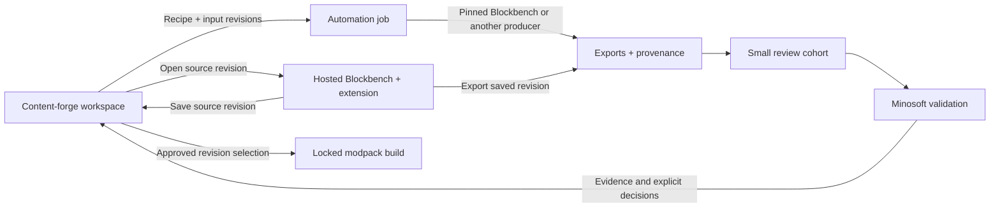

<!-- Copyright (C) 2026 Jacob Repp; SPDX-License-Identifier: GPL-3.0-or-later -->
# Content-forge workspace and Blockbench integration

Status: working design, reflecting the product direction discussed 2026-09-08.
The [workspace implementation](local-workspace.md) now connects the catalog,
source revisions, pinned web editor sessions, shared reviews, consumer evidence,
and approved pack selections on the local workspace server. Public hosting and
organization identity integration remain separate platform work.

Content-forge is the team's content harness: it manages demand, assets, family
relationships, generation, retained sources, review, provenance, and modpack
builds. Blockbench is a workspace launched from content-forge to edit an asset
or family, run automation, and produce exports through the actual editor codecs.
An author should work from one asset record through to a reviewable build.

## Ownership

| Component | Owns |
| --- | --- |
| Content-forge | Projects, asset/family catalog, work queue, source revisions, generation recipes/jobs, assignments, review decisions, provenance graph, pack manifests and builds |
| Blockbench | Active editing project, geometry, textures, UVs, animation, Undo, format/codec behavior, editor tools, observation and mutation automation |
| Integration extension | Workspace context in Blockbench; launch handshake; revision-bound open/save/export; progress and diagnostics returned to content-forge |
| Turbo Ogre | Project identity/access, artifact storage, deployments, and shared infrastructure capabilities as implemented behind the public SDK |
| Minosoft and other consumers | Demand and compatibility requirements, in-game visual/behavior validation, and acceptance evidence |

Content-forge can offer other editors and producers using the same asset and
revision model. Blockbench is the first integrated editing surface, not the
definition of every asset type. Public hosting clients remain independent of
Blockbench model commands.

## Launch and editing experience

An asset or family page presents its source revision, current candidate build,
review state and an **Edit in Blockbench** action. The first implementation opens
a dedicated hosted editor tab. A docked/embedded editor can follow once focus,
keyboard shortcuts, dialogs, fullscreen and browser permission behavior have
been exercised; both presentations use the same session contract.

Use a pinned build of the automation-enabled fork with a small content-forge
extension. The hosted editor executes in the author's browser; serving its web
bundle does not allocate a server-side renderer for each human editor. An
automated job still needs a managed browser/editor process. Desktop Blockbench
can later attach through the same logical contract with a local adapter.

Blockbench already has a web build, plugin support, and
[launch parameters](https://blockbench.net/wiki/docs/url-parameters/).
The inspected `js/web.js` can open JSON/image content and prompt for plugins.
That supplies launch plumbing, but does not save revisions into content-forge,
authenticate a team workspace, or establish a session-bound automation bridge.

The extension should add workspace context, save/checkpoint, export candidate,
and return-to-review actions. It uses the existing automation host and supported
editor APIs. Missing generic operations belong in Blockbench's automation host;
team catalog and pack-building logic stay in content-forge.

## Session and source contract

The session contract below is implemented by the local workspace's launch,
attach, ready, save, export, and revoke routes. Remote platform deployment will
need the same scope checks behind its identity and routing adapters:

| Operation | Required behavior |
| --- | --- |
| Launch | Resolve authorized project, asset/family, base source revision, editor build/extension digest and allowed operations; return a session identifier and editor launch location |
| Attach/ready | Bind the browser/editor instance and active project UUID; negotiate bridge version and methods; report tool identity before loading or mutating |
| Open | Load the exact retained source and its declared dependencies; verify hashes; acknowledge the loaded source revision |
| Checkpoint/save | Upload source bytes and referenced texture changes as a new immutable revision; compare the expected previous revision; acknowledge durable storage before the editor reports a successful shared save |
| Export | Export a saved source revision with an explicit format/profile; produce outputs and evidence bound to the source and toolchain identities |
| Detach/recover | Preserve unacknowledged edits, distinguish saved versus unsaved work, resume by session/revision when allowed, and close only the owned project |

Use `.bbmodel` as the retained editing source and consumer formats as exports.
External source files need a declared dependency manifest; embedding a texture
must not make its lineage disappear. Browser-local Undo/autosave is separate
from an acknowledged workspace save.

For Git-backed projects, distinguish the committed base from draft workspace
revisions and built candidates. Record the base commit with each draft; a save
does not silently commit, merge, or overwrite a checkout. An explicit change
submission materializes the selected source revision for repository review.
Until that integration exists, export/download remains a visible manual step.

Concurrent editing first uses conflict detection: two sessions may open the
same base, but a stale save cannot replace a newer accepted revision. Preserve
the second draft and present an explicit conflict or branch choice. Live
multi-user editing is a later feature; Blockbench's edit-session transport does
not establish workspace persistence or review authority.

The bridge and backend enforce project, asset, operation, expiry and source
revision scope. A launch URL contains routing identifiers, not raw project
content or reusable bearer credentials. Use an authenticated bootstrap and
validate the editor origin/instance on browser messages. Editor plugins execute
code, so the managed session must identify the approved extension/tool set;
an editor's plugin permission is not a project administration grant.

## Provenance, generation, review and packs

Record immutable inputs and outputs, rather than only recording that a tool ran:

| Record | Minimum links |
| --- | --- |
| Source revision | Asset/family identity, parent revision, source/dependency hashes, author identity, base repository commit where applicable |
| Generation/export job | Input source revisions, recipe/parameters and seed where applicable, exact tool/extension/exporter builds, execution identity, status and diagnostics |
| Candidate artifact | Job/source identities, target format/profile, output file hashes and validation results |
| Review | Reviewer, exact candidate snapshot, findings/decision, and matching in-game evidence |
| Pack build | Explicit selected asset versions, dependency closure, consumer/game/mod compatibility profile, build-tool identity and resulting manifest/digest |

Human edits and generated candidates enter the same revision and review flow.
Automated success creates a candidate; approval is an explicit decision on its
exact evidence. Source or output changes invalidate applicability of older
review evidence without deleting its history. The Minecraft style and quality
standard remains the acceptance criterion, even when the technical export passes.

A modpack build selects approved versions deliberately. Review builds may
contain candidates and must display that state. Building, hosting a review,
approving artwork, and promoting a game pack remain distinct operations.

## First vertical slice

Use one retained item family and a bounded cohort:

1. Content-forge shows the family, source revision and last candidate, then
   launches the pinned hosted editor from **Edit in Blockbench**.
2. The extension attaches, verifies the revision and opens the family. The
   author edits using ordinary Blockbench tools and Undo.
3. **Save to content-forge** creates an acknowledged source revision. A stale
   save retains the draft and reports the conflict without losing either edit.
4. **Build review candidate** exports that saved revision, records the complete
   toolchain, and updates the small review sheet with source/download links.
5. A teammate reviews the exact snapshot. In-game evidence can be attached
   before approval; an approved selection enters a reproducible pack build.

Acceptance must exercise the real hosted editor, not only a mock bridge:
opening the correct revision, an edit/save/reopen round trip, stale saves,
interrupted-save recovery, revoked access, a wrong-session message, and export
identity. Prove that the reviewed candidate corresponds to the saved source.
The first demonstration can use one author and one reviewer with conflict
refusal; it does not need simultaneous cursor collaboration.

## Relationship to the current pipeline

Today the repository has retained family sources, a catalog with immutable
draft revisions, conflict-safe editor saves, pinned hosted editor launch,
revision-bound exports and shared reviews, consumer-evidence attachment, and
approved resource-pack builds. Local account invitations support one author and
one reviewer; organization SSO and remote fleet deployment need platform work.
The static hosted review site is a useful delivery milestone within this larger
workspace product; it is not the full product scope.

Pin editor and extension builds for both interactive and automated sessions.
Review packaging should have its own dependencies. Extracting the portable
texture generator into a shared package is useful maintenance work, but is not
a prerequisite for proving the hosted edit/save/review loop.

See [retained item-family workflow](item-family-review.md),
[quality standards](asset-style-standards.md), [hosting](hosting.md), and the
[SDK API assessment](https://github.com/turbo-ogre/sdk/pull/2).
